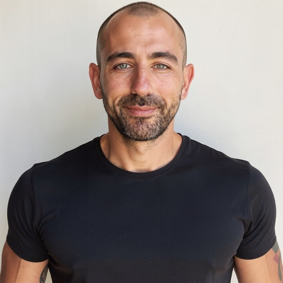

# Daniel Wahnich

Founder, Aweb — independent researcher in runtime safety for autonomous systems.

I build [Aweb](https://aweblabs.ai), mission-control infrastructure for AI agent workforces: agents do the work, a trust runtime governs it, and every action leaves a verifiable receipt. In parallel I do independent research on closed-loop safety evaluation of autonomous driving planners. Both run on the same process: pre-registered experiments, published nulls, and results that regenerate from committed evidence.

## Selected work

**[Sentinel](https://github.com/manfromnowhere143/sentinel)** — runtime safety monitor for a frozen end-to-end driving planner, developed over 50 pre-registered iterations. Independently reproduces the NeuroNCAP UniAD baseline (2.12 vs the published 1.84, corroborated by DMAD's independent rerun) and lifts the monitored benchmark score to 2.91 (95% CI on the delta [+0.605, +0.928]) at zero measured deployment cost. Every number regenerates from committed evidence. Paper: [preprint PDF](https://github.com/manfromnowhere143/sentinel/blob/master/docs/paper/paper.pdf), arXiv submission in progress.

**[PerceptionProof](https://github.com/manfromnowhere143/perceptionproof)** — do cheap label-free signals predict human-rated long-tail driving failure where open-loop metrics mis-rank closed-loop safety? A reproducible validity study with a published negative-results arc.

## Links

[aweblabs.ai](https://aweblabs.ai) · [danielwahnich.dev](https://danielwahnich.dev) · [LinkedIn](https://www.linkedin.com/in/daniel-wahnich-048326412)

